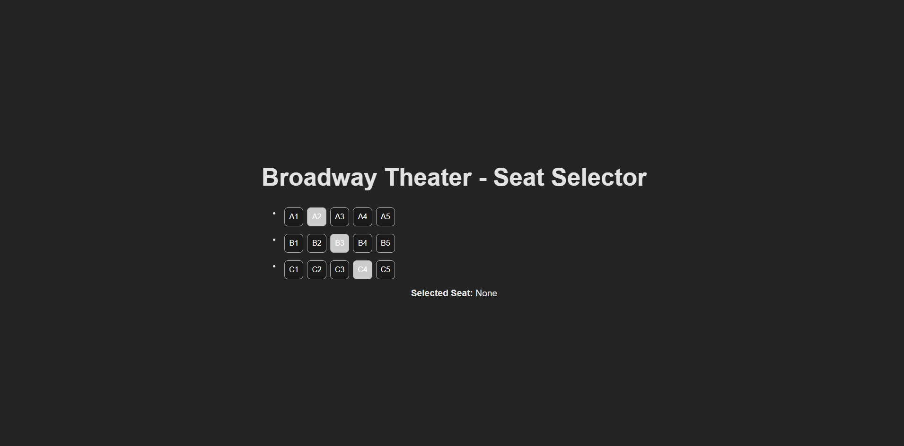

## **🎭 Project: Ticket Seat Selector**

### **Description**

A small Vue 3 + TypeScript + Atomic Design implementation demonstrating **accessible dropdowns** in an entertainment-industry context (e.g., Broadway seat selector).

---

## **🧱 Atomic Design Breakdown**

- **Atoms:** _Seat.vue_
- **Molecules:** _SeatRow.vue_
- **Organisms:** _Seatmap.vue_
- **Templates / Pages:** _In Dev_

---

## **🛠 Tech Used**

- Vue 3
- TypeScript
- Vite
- Atomic Design
- Local mock data only

---

## **🚀 Running Locally**

```bash
npm install
npm run dev
```

---

## **📸 Demo Screenshot**

__

---

## **📝 Learning Notes**

### ** Semantic Structure Comes First **
Every interactive widget must begin with the HTML element that inherently matches its action:
- Toggle → <button>

- Choose from options → list structure (<ul><li>)

- Dialog → <dialog> or <div role="dialog">

- Expand/collapse → <button> controlling a region

### ** A Widget Is Not Accessible Until It Has: **

- Correct semantics

- Correct focus management

- Correct keyboard interaction

- State announcements (ARIA or live regions)

```
Semantics → Keyboard → ARIA → Announcements

```
---

## **🔮 Future Enhancements**

- Accessibility layer (keyboard, ARIA, roles)
- API for real seat maps
- Animated transitions
- Pricing/seat tiers (orchestra, mezzanine)

---
